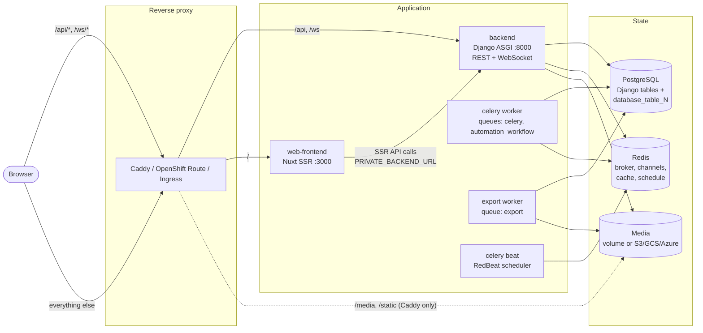
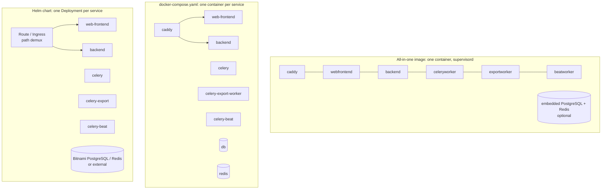
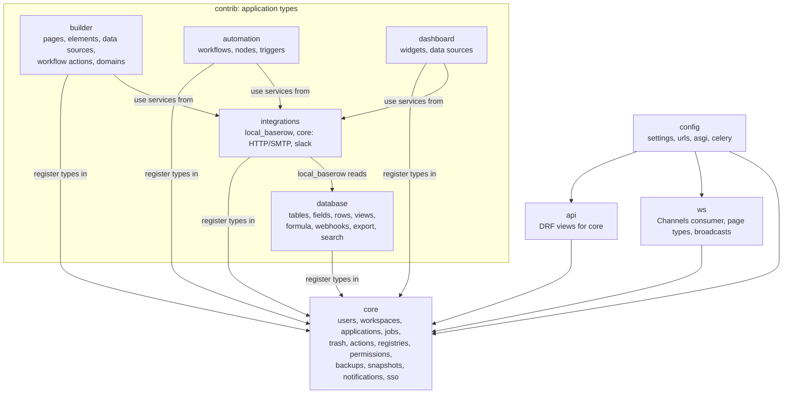
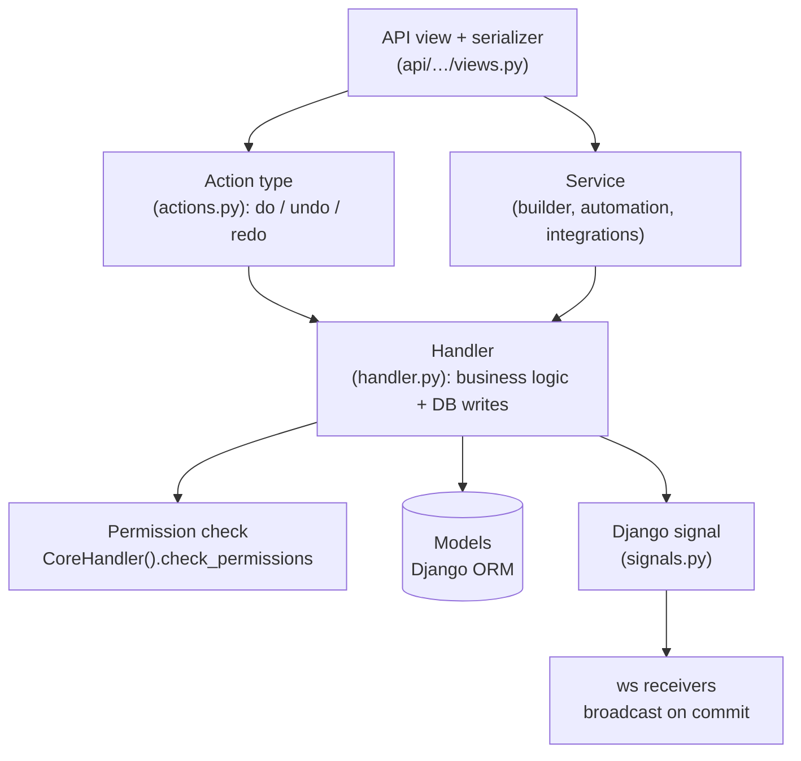
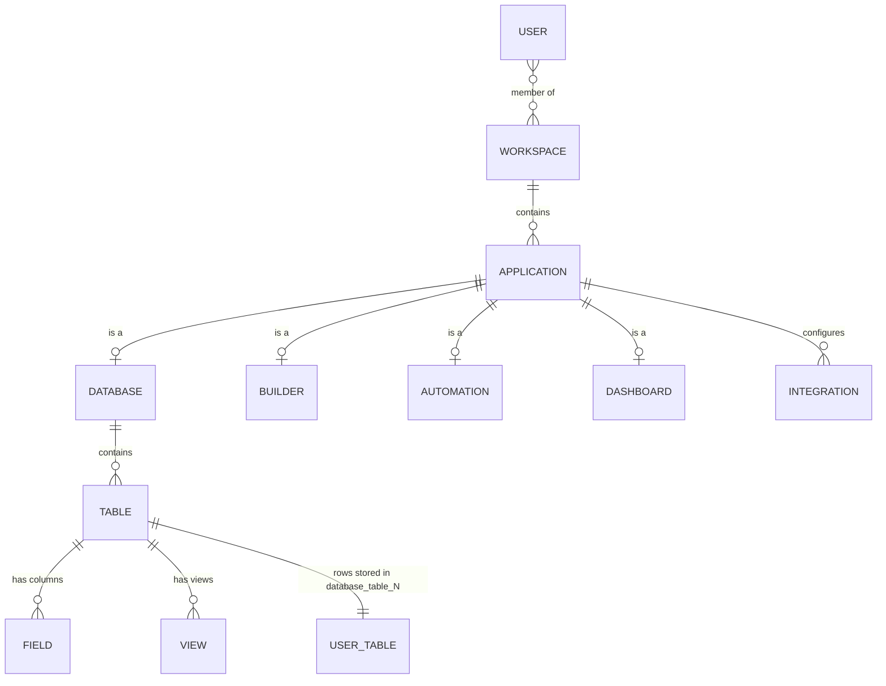
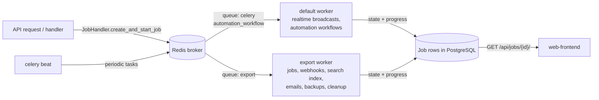
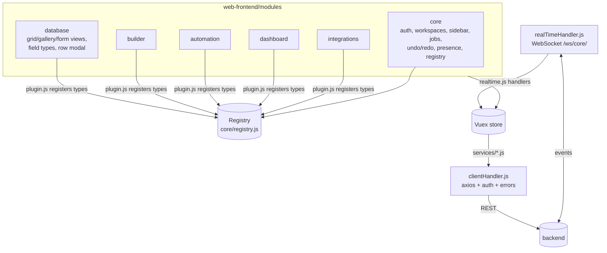
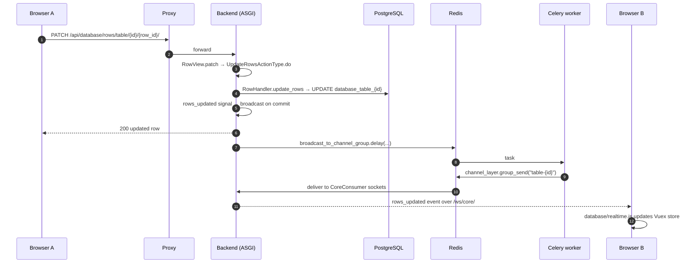

# Architecture

How Saveroom is put together: the services that run, how the code is organised, and how
a change travels from one browser to every other open tab. Read this first if you are
going to operate, debug or change Saveroom.

## At a glance

Saveroom is two applications plus background workers:

- **Backend**: a Django application, served as ASGI by gunicorn with uvicorn workers. It
  owns all state and exposes it through the REST API (`/api/`) and a WebSocket endpoint
  (`/ws/`). It has no user interface of its own.
- **Web frontend**: a Nuxt (Vue) application. Its Node server renders the first page
  (SSR); the browser then talks to the backend directly.
- **Celery workers**: the default worker runs realtime broadcasts and automations. The
  export worker runs jobs (imports, exports, duplication, snapshots, backups), webhooks,
  search indexing, notification emails and cleanup. Beat schedules periodic tasks.
- **PostgreSQL** stores everything, including the tables users create.
- **Redis** is the Celery broker, the beat schedule store, the Channels (WebSocket)
  layer and the cache.
- **Media storage** holds uploaded files. It is a local directory by default, or S3, GCS
  or Azure Blob storage.

The browser always reaches the backend at `PUBLIC_BACKEND_URL` (normally the same origin
as the frontend). The Nuxt server reaches it at `PRIVATE_BACKEND_URL`, usually the
in-cluster address `http://backend:8000`.

## Deployment shapes

All deployments run the same processes. What differs is how they are packaged and what
does the path routing.

| | All-in-one image | `docker-compose.yaml` | Helm chart |
|---|---|---|---|
| Guide | [Docker](installation/install-with-docker.md) | [Docker Compose](installation/install-with-docker-compose.md) | [Helm](installation/install-with-helm.md) |
| Packaging | `deploy/all-in-one/`; supervisord runs every process | Builds `backend` and `web-frontend` from source | Standalone `backend` and `web-frontend` images |
| Router | Embedded Caddy (`Caddyfile`) | Caddy container (`Caddyfile`) | OpenShift Route or Ingress; `backendPaths` (`/api`, `/ws`, `/static`) go to the backend |
| Media | Local volume, served by Caddy at `/media` | `media` volume, served by Caddy | S3 by default, or a PVC |
| PostgreSQL / Redis | Embedded, or external | `db` and `redis` containers | Bundled subcharts, or external |
| Scaling | One container | Per service | Per Deployment; runs under OpenShift `restricted-v2` |

!!! note "Two worker queues"
    Most background work is bound to the `export` Celery queue: `run_async_job` (every
    job), webhooks, search indexing, notification emails, backups, scheduled exports and
    cleanup tasks (`queue="export"` in the `tasks.py` modules and `CELERY_TASK_ROUTES` in
    `backend/src/baserow/config/settings/base.py`). Every deployment therefore runs a
    `celery-exportworker` next to the default `celery-worker`: `exportworker` in the
    all-in-one image, `celery-export-worker` in `docker-compose.yaml` and the
    `celery-export` Deployment in the Helm chart. With `BASEROW_RUN_MINIMAL` and
    `BASEROW_AMOUNT_OF_WORKERS=1` the default worker takes both queues and the export
    worker idles.

## Repository layout

| Path | What it holds |
|---|---|
| `backend/` | Django project: `src/baserow/` (code), `tests/` (mirrors `src/`), `docker/docker-entrypoint.sh` (every process starts here), `Dockerfile`, `pyproject.toml` / `uv.lock` |
| `web-frontend/` | Nuxt app: `modules/` (feature modules), `nuxt.config.ts`, `env-remap.mjs` (env to Nuxt runtime config), `test/`, `Dockerfile` |
| `e2e-tests/` | Playwright end-to-end suite |
| `deploy/` | `all-in-one/` image, `helm/saveroom/` chart, `caddy/`, `branding-example/`, `plugins/` (plugin boilerplate tooling) |
| `formula/` | ANTLR grammar for the formula language |
| `integrations/` | Third-party integrations, such as Zapier |
| `changelog/` | Changelog entries and generator (`just changelog …`) |
| `docs/` | This site, ADRs (`docs/adr/`) |
| `docker-compose.yaml` | Simple production-like stack (see above) |
| `docker-compose.yml` + `docker-compose.dev.yml` | Development stack with hot reload, driven by `just` |
| `Caddyfile`, `Caddyfile.dev` | Reverse proxy configuration |
| `justfile` | Task runner entry point; dispatches to per-area justfiles |

## Backend

### Django apps

`backend/src/baserow/` is split into a small core and optional apps under `contrib/`.
Every app plugs its types into shared registries, so the core never imports a contrib
app directly.

| Package | Responsibility |
|---|---|
| `config/` | Settings (`settings/base.py`), URL root, `asgi.py` (HTTP plus WebSocket router), `celery.py`, read-replica DB router |
| `core/` | Users, workspaces, the application abstraction, jobs, trash, undo/redo actions, registries, permission managers, backups, snapshots, notifications, OIDC SSO, data destinations |
| `api/` | REST endpoints for `core` concepts, mounted under `/api/` |
| `ws/` | `CoreConsumer` at `/ws/core/`, page types (who subscribes to what), broadcast tasks, presence |
| `contrib/database/` | The database application: tables, fields, rows, views, filters, formulas, webhooks, import/export, search |
| `contrib/builder/` | The application builder: pages, elements, data sources, workflow actions, published domains |
| `contrib/automation/` | Automations: workflows built from trigger and action nodes |
| `contrib/dashboard/` | Dashboards: widgets backed by data sources |
| `contrib/integrations/` | Service and integration types that builder, automation and dashboard nodes call |

Third-party plugins load as extra Django apps through `BASEROW_BACKEND_PLUGIN_NAMES` (see
[Plugins](plugins/introduction.md)).

### Layers inside a feature

Each feature follows the same stack. API views stay thin, and the rest can be called from
views, Celery tasks, management commands or tests alike.

- **Handlers** (`*Handler`) hold the business logic. Example:
  `RowHandler.update_rows` in `contrib/database/rows/handler.py`.
- **Action types** wrap handler calls that users can undo. See the
  [undo/redo guide](technical/undo-redo-guide.md).
- **Services** add permission checks and dispatch for the builder, automation and
  integration domains.
- **Registries** hold pluggable `Instance` types: field types, view types, application
  types, element types, permission managers and so on. See the
  [permissions guide](technical/permissions-guide.md) and
  [database plugin](technical/database-plugin.md).
- **Signals** fan out side effects such as realtime broadcasts, webhooks, notifications
  and search indexing without coupling them to the handler.

### Data model

Each user-created table is a real PostgreSQL table named `database_table_<id>`, with one
column per field (`field_<id>`). The backend builds a Django model for it on the fly with
`Table.get_model()`. See [Table persistence](technical/table-persistence.md).

### Async work

Long operations run as **jobs**: a database row tracks state and progress, and a Celery
task does the work. See the [jobs pattern](patterns/jobs.md).

## Web frontend

`web-frontend/modules/` mirrors the backend apps. Each module is a Nuxt module that
registers routes, Vuex stores and `*Type` classes into the client-side registry.

| Piece | Where |
|---|---|
| Module wiring | `modules/<name>/module.js`, `plugin.js`, `routes.js` |
| Pluggable types | `fieldTypes.js`, `viewTypes.js`, `applicationTypes.js`, … registered in `plugin.js` |
| State | `modules/<name>/store/` (Vuex) |
| HTTP | `modules/core/plugins/clientHandler.js` plus `modules/*/services/` wrappers |
| Realtime | `modules/core/plugins/realTimeHandler.js` plus `modules/*/realtime.js` event handlers |
| Runtime config | `env-remap.mjs` maps `PUBLIC_BACKEND_URL` and similar variables to Nuxt runtime config |
| Branding | Loaded at runtime from `BASEROW_BRANDING_DIR` ([Branding](installation/branding.md)) |

## Request flow: editing a cell

This flow shows most of the architecture in one pass: REST, an undoable action, the
handler, a signal, Celery and the Channels layer.

The sender's `web_socket_id` is excluded from the broadcast, so browser A doesn't apply
its own change twice. For more, see [WebSockets](technical/websockets.md) and
[Realtime presence](technical/realtime-presence.md).

## Where to go next

- Run it: [Docker Compose](installation/install-with-docker-compose.md) or
  [Helm](installation/install-with-helm.md).
- Change it: [Development environment](development/development-environment.md).
- Extend it without forking: [Plugins](plugins/introduction.md).
